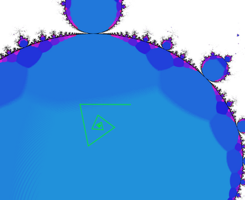
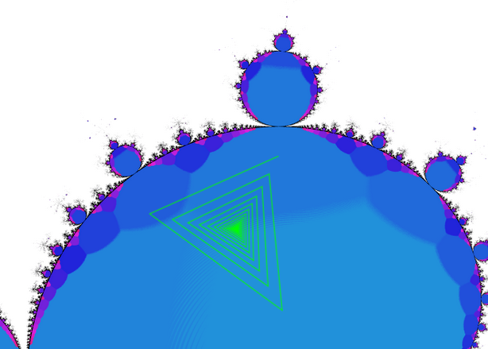
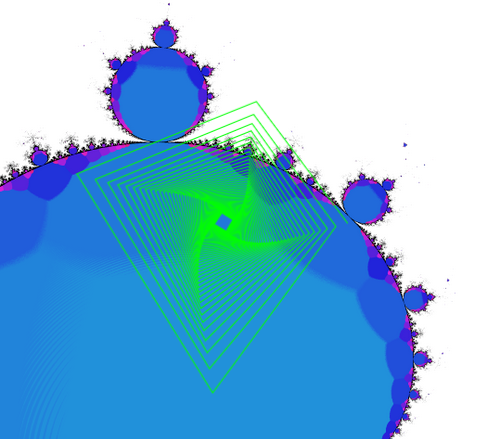
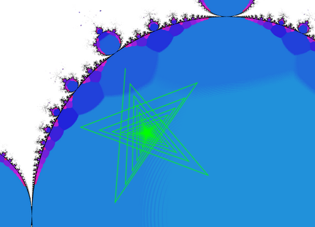
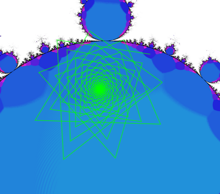
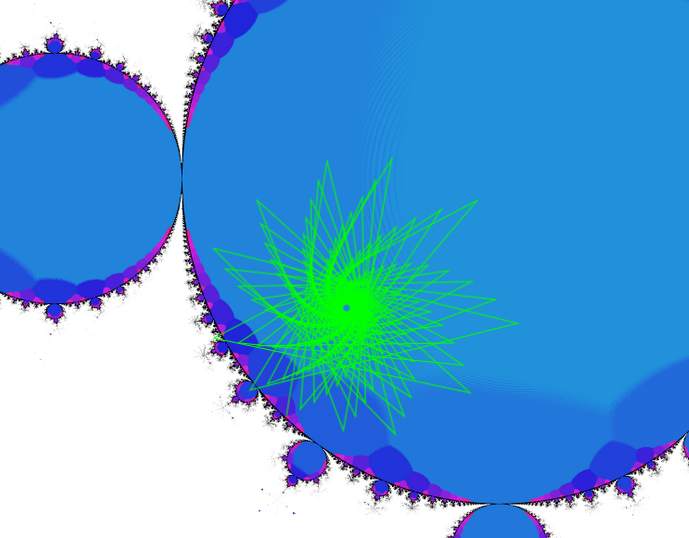
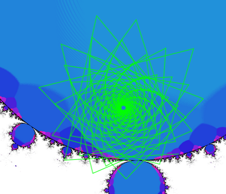
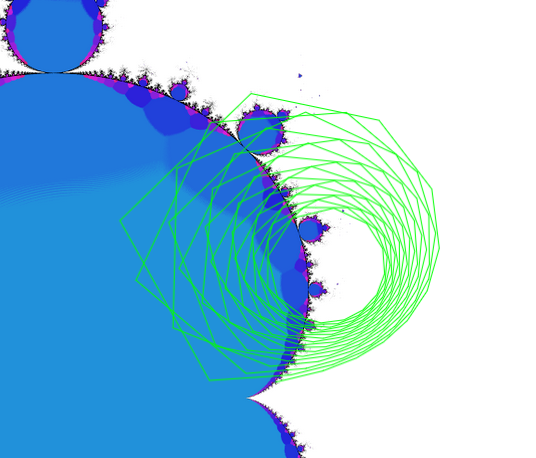

## Mandelbrot Trajectories

This is an extension / fork of a [previous project](https://github.com/jeremy-rifkin/mandelbrot-orbits).

The Mandelbrot is defined as points  for which the iteration of  does
escape towards infinity.

When complex numbers are multiplied, they appear to rotate on the complex plane. Tracing the
trajectories can lead to cool shapes - spirals and stars.



How many points do these spirals/stars have based off of their starting location?

When investigating algorithms to [identify periods of orbits in the Mandelbrot](https://github.com/jeremy-rifkin/mandelbrot-orbits) I came up
with an algorithm that can quantify apparent "shapes". Check out the inter-active app
[**here**](https://rifkin.dev/projects/mandelbrot-trajectories/).

The result of the algorithm is this, displaying the various regions that will produce various
shapes:


### Project layout:

General overview:

```
bin         - compiled binaries, object files, and dependency files
gui         - typescript and sass gui code
gui-dist    - html code and compiled js
screenshots - trajectory screenshots used on the web page and README
src         - C++ render code
```

Kickstart:

```bash
npm i
make
./bin/mandelbrot.exe
webpack
cp -rv render.png screenshots gui-dist
```
